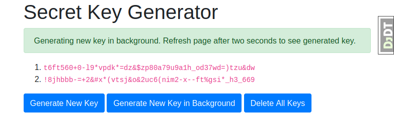

# Django Docker Heroku Tutorial

This tutorial demonstrates how to configure a [Django](https://www.djangoproject.com/)
app for development in [Docker](https://en.wikipedia.org/wiki/Docker_%28software%29)
and deployment to [Heroku](https://www.heroku.com/what).

While the app is intentionally very simple&mdash;it generates random tokens that can
be used as Django secret keys&mdash;the configuration is relatively complex:

* [Postgres](https://www.postgresql.org/) is used for the database
* [Redis](https://redis.io/) is used for the cache
* [Django-RQ](https://github.com/rq/django-rq) is used to process background jobs

Additionally [WhiteNoise](http://whitenoise.evans.io/en/stable/django.html) is
used to manage static files and [Django Debug Toolbar](https://django-debug-toolbar.readthedocs.io/en/latest/)
is configured to run in the Docker development environment.

Please note that this is *not* a general tutorial on Django development or using
Docker. I assume that you're familiar with Django and are at least aware of
Docker, and the benefits of containerization more generally, but want to learn
how to configure a simple but real-world Django application for development in
Docker, and, as a bonus, deployment to Heroku.

## Contents

- [Developing in Docker](#developing-in-docker)
  - [Quick Start](#quick-start)
  - [Django Dockerfile](#django-dockerfile)
  - [Docker Compose Services](#docker-compose-services)
  - [Running Django Debug Toolbar in Docker Compose](#running-django-debug-toolbar-in-docker-compose)
- [Deploying to Heroku](#deploying-to-heroku)
  - [Quick Start](#quick-start-1)
  - [Heroku Procfile](#heroku-procfile)
  - [Why Deploy to Heroku](#why-deploy-to-heroku)
  - [Why Not Deploy to Heroku](#why-not-deploy-to-heroku)
- [Further Reading](#further-reading)
- [Conclusion](#conclusion)

## Developing in Docker

### Quick Start

Prerequisites:

* [Git](https://git-scm.com/)
* [Docker](https://docs.docker.com/install/)
* [Docker Compose](https://docs.docker.com/compose/install/)

Download the tutorial code into a new directory:

```sh
$ git clone https://github.com/jbarham/django-docker-heroku-tutorial.git djheroku
$ cd djheroku
```

Run `docker-compose up -d --build` to download the Docker images and bring
up the development environment in Docker Compose. This will take a while the
first time, but on subsequent runs will be much quicker as the Docker images
will be cached.

Assuming the above step succeeded, you should now have a Django app running
in a Docker container service named `web`, connected to other container
services running Postgres and Redis, and a separate background task runner.

However, the Postgres database will be empty. Populate it by running:

```sh
$ docker-compose exec web python manage.py migrate
```

The above command runs the command `python manage.py migrate` in the Django
Docker container. You could accomplish the same by running:

```sh
$ docker-compose exec web bash
# python manage.py migrate
# exit
```

All going well you should now be able to open the Django app at
http://localhost:8000/.



Obviously it doesn't take two seconds to generate a random
key but the background task sleeps for two seconds to simulate a real-world
time consuming operation such as sending an email or generating a PDF.

When you're finished with the app just run `docker-compose down` to stop
the app and its supporting services.

### Django Dockerfile

At the heart of Docker is the `Dockerfile`, a simple plain text file that
defines how to build a Docker *image* which can be run as a Docker *container*.

Here is the `Dockerfile` for our Django app in its entirety:

```
# Pull base image
FROM python:3.6-slim

# Install psql so that "python manage.py dbshell" works
RUN apt-get update -qq && apt-get install -y postgresql-client

# Set environment variables
ENV PYTHONDONTWRITEBYTECODE 1
ENV PYTHONUNBUFFERED 1

# Set work directory
WORKDIR /app

# Install dependencies
COPY requirements.txt /app/requirements.txt
RUN pip install -r /app/requirements.txt

# Copy project
COPY . /app/
```

By itself, though, this Dockerfile doesn't provide much more than we
could get from developing our Django app in a traditional Python virtual
environment.

This is where Docker Compose comes in.

### Docker Compose Services

Here is a summary of Docker Compose from the [official
documentation](https://docs.docker.com/compose/):

> Compose is a tool for defining and running multi-container Docker
applications. With Compose, you use a YAML file to configure your application’s
services. Then, with a single command, you create and start all the services
from your configuration.

Our Docker Compose configuration file, [`docker-compose.yml`](./docker-compose.yml),
defines four services, `web`, `worker`, `db` and `redis`, each of which runs in
a separate Docker container. (Note that the internal hostname for each service
is the same as the service name. So to connect to the Redis server from Django we
use `redis:6379` as the *hostname:port* pair.)

Taking each service in turn:

```
  web:
    build: .
    command: python manage.py runserver 0.0.0.0:8000
    environment:
      DEBUG: 1
    volumes:
      - .:/app
    ports:
      - 8000:8000
    depends_on:
      - db
      - redis
```

The `web` service runs our Django app in a Docker container defined by our
`Dockerfile`.

We set the environment variable `DEBUG=1` which sets the `DEBUG` variable in the
app's [`settings.py`](djheroku/settings.py) file to `True`.

The `volumes` section says that we want to map the current directory to the
`/app` mountpoint in the Docker container. This means that any changes made to
the application code while the container is running cause the Django server to
reload, as it would it if were running outside of Docker. (Tangentially, this 
also explains why we set the `PYTHONDONTWRITEBYTECODE` flag in our Dockerfile.
Since Django is run by the `root` user inside the `web` container, we don't
want the root user to save cached bytecode files to our application directory.)

```
  worker:
    build: .
    command: python manage.py rqworker default
    environment:
      DEBUG: 1
    volumes:
      - .:/app
    depends_on:
      - web
```

The `worker` service runs [Django-RQ](https://github.com/rq/django-rq) to
process background tasks. Since Django-RQ runs as a Django management command,
it's configured very similarly to the Django app server,
with the notable exception that we don't define a port mapping since it doesn't
have a web interface.

```
  db:
    image: postgres:latest
    restart: always
    environment:
      POSTGRES_PASSWORD: postgres
      POSTGRES_USER: postgres
      POSTGRES_DB: djheroku
    volumes:
      - pgdata:/var/lib/postgresql/data/
```

The `db` service installs and configures a full-blown Postgres database server,
creating a database for our Django app, using the most recent Postgres Docker
image. This is where using Docker really shines.

For more details on the configuration environment variables see the
[Docker Postgres documentation](https://hub.docker.com/_/postgres/).

We define a `volumes` section for our database so that the data itself is saved
outside of the database container. Otherwise when the container is shut down
we'd lose the contents of our database!

```
  redis:
    image: redis:latest
```

Short and sweet, the `redis` service says that we want a Redis server in our
Docker Compose environment, and we're happy with the default configuration.

### Running Django Debug Toolbar in Docker Compose

[Django Debug Toolbar](https://django-debug-toolbar.readthedocs.io/en/latest/)
is an invaluable plugin for Django developers as it provides very detailed
runtime profiling information that you can use to optimize your app's database
queries and templates.

By default Django Debug Toolbar only runs if the Django settings `DEBUG`
flag is set to `True` and the development server's IP address is defined in the
[INTERNAL_IPS](https://docs.djangoproject.com/en/dev/ref/settings/#internal-ips)
list. In development `INTERNAL_IPS` is typically set to `['localhost', '127.0.0.1']`.

However, services running in Docker Compose are assigned an ephemeral IP address
so Django Debug Toolbar won't run. To enable Django Debug Toolbar in Docker
Compose we instead used the following configuration option in our
[`settings.py`](djheroku/settings.py):

```python
DEBUG_TOOLBAR_CONFIG = {
    'SHOW_TOOLBAR_CALLBACK': lambda request: DEBUG,
}
```

See the [Django Debug Toolbar documentation](https://django-debug-toolbar.readthedocs.io/en/latest/configuration.html#show-toolbar-callback) for more details.

## Deploying to Heroku

### Quick Start

Prerequisites:

* [Create a free Heroku account](https://signup.heroku.com/)
* [Install and log into the Heroku CLI](https://devcenter.heroku.com/articles/heroku-cli)

Run `heroku create` to create a new Heroku app with a randomly generated name.

Create a new Heroku Postgres database:

```sh
$ heroku addons:create heroku-postgresql:hobby-dev
```

Once Heroku has finished creating the Postgres database, it will create the
environment variable `DATABASE_URL` which contains the login credentials to the
database. You can view the Heroku app's environment by running `heroku config`.

Create a new Heroku Redis server:

```sh
$ heroku addons:create heroku-redis:hobby-dev
```

Similarly Heroku will create an environment variable `REDIS_URL` once it's
finished creating the Redis instance.

Since Heroku is our production environment, for security we should override the
default Django SECRET_KEY by setting the SECRET_KEY environment variable.
Copy a generated key from the development app and run:

```sh
$ heroku config:set SECRET_KEY='replace me with a generated secret key'
```

Time to go live! Upload and deploy our app to Heroku:

```sh
$ git push heroku master
```

This will take some time as Heroku builds the app and deploys it to a web dyno,
comparable to a Docker container.

You should now able to view the Django app running in Heroku by running
`heroku open`.

The background task runner isn't run by default so spin one up:

```sh
$ heroku ps:scale worker=1
```

Shut down the app in Heroku by running:

```sh
$ heroku ps:scale web=0 worker=0
```

Free Heroku web dynos will automatically [go to sleep after 30 minutes of inactivity](https://devcenter.heroku.com/articles/free-dyno-hours#dyno-sleeping) but worker dynos will keep running until you
explicitly shut them down.

To permanently delete the Heroku app, including the Postgres database and Redis
server, run `heroku apps:destroy`.

### Heroku Procfile

Our app directory already contains a top-level `requirements.txt` file, which
tells Heroku that this is a Python app and it should `pip` install the packages
in the requirements file when it builds the app.

How our app should be run after it's been built is defined in a `Procfile`:

```
release: python manage.py migrate

web: gunicorn djheroku.wsgi --log-file -

worker: python manage.py rqworker default
```

The `release` line specifies that we want Heroku to run database migrations on
the app in the app's release phase. See the
[Heroku documentation](https://devcenter.heroku.com/articles/release-phase)
for more details.

The `web` process type defines how to run our Django web server. Since we're running
in production we use `gunicorn` instead of Django's test server that we use in
Docker. See the
[Heroku documentation](https://devcenter.heroku.com/articles/getting-started-with-python?singlepage=true#define-a-procfile)
for more details.

Finally the `worker` process type defines how to run our background task runner.
Note that the command is exactly the same as the worker service in our Docker
Compose configuration.

### Why Deploy to Heroku

We've seen above how we can deploy a Django app to Heroku, using Postgres and
Redis, with a background job runner, by writing a three line `Procfile` config
file and running `git push heroku master`. That's really as easy as it gets to
deploy a web app to production.

By comparison
[this tutorial](https://www.digitalocean.com/community/tutorials/how-to-set-up-django-with-postgres-nginx-and-gunicorn-on-ubuntu-18-04)
shows how to set up Django with Postgres, Nginx and Gunicorn to run on a
[Digital Ocean](https://www.digitalocean.com/) virtual machine. It's a clear,
comprehensive tutorial which I've referenced many times myself. You'll also notice
that it's very long, with lots of steps, each of which must be completed
without making a mistake to get your app up and running. If you want to get the
same app running on a different (e.g., bigger) virtual machine, you'll have to
repeat the process all over again, or write a script.

### Why Not Deploy to Heroku

By default Django uses SQLite for its database. SQLite is an excellent option for
Django sites that are [predominantly
read-only](https://docs.djangoproject.com/en/dev/ref/databases/#sqlite-notes)
and will only ever run on a single server. But using SQLite as your database on
Heroku isn't an option since [Heroku dyno filesystems are
ephemeral](https://devcenter.heroku.com/articles/dynos#ephemeral-filesystem).

I run a hobby site, [M43 Lenses](https://www.m43lenses.com/), that gets light
traffic and is only updated by me so it runs happily on a $5/month Digital Ocean
VM using SQLite for its database.

Another consequence of the ephemeral nature of the filesystem on Heroku dynos
is that if you have a site that allows users to upload e.g. image files, you
will need to configure your app to save those files to an external file storage service
such as [AWS S3](https://aws.amazon.com/s3/). This is pretty straightforward to
set up in Django using [django-storages](https://django-storages.readthedocs.io/en/latest/index.html),
but you may decide that it's more trouble than it's worth to set up on Heroku
and stick with conventional VM hosting providers like Linode or Digital Ocean
that provide permanent disk storage with your VM.

## Further Reading

Will Vincent has published many excellent Django tutorials on his websites
[wsvincent.com](https://wsvincent.com/) and [learndjango.com](https://learndjango.com/).
I also highly recommend [his books](https://wsvincent.com/books/) for beginner
and experienced Django developers.

Similar to this tutorial, Will develops a detailed example in his book
[*Django for Professionals*](https://djangoforprofessionals.com/) on how to
develop a Django app in Docker and deploy it to Heroku. My tutorial is different
in that I do not use Pipenv (which seems to have fallen out of fashion since
*Django for Professionals* was published) and I don't deploy to Heroku's
alternative Docker runtime environment.

For intermediate to advanced Django developers I highly recommend the
[*Two Scoops of Django*](https://www.feldroy.com/collections/two-scoops-press)
series by Daniel and Audrey Feldroy (formerly Daniel and Audrey Roy Greenfeld).

Vitor Freitas has published a number of very hiqh quality, in-depth articles
about Django development on his website
[Simple is Better Than Complex](https://simpleisbetterthancomplex.com/).

For the official Heroku Python/Django tutorial read [Getting Started on Heroku with Python](https://devcenter.heroku.com/articles/getting-started-with-python).

[The Twelve-Factor App website](https://12factor.net/) lists best practices for
developing and deploying software-as-a-service web apps. The 12 factors were
formulated by Adam Wiggins, one of the cofounders of Heroku.

## Conclusion

If you've got this far, congratulations! My goal in writing this tutorial was
to present some of the knowledge that I've learned by trial and error developing
Django web apps in Docker and deploying them to Heroku. Your particular context
will be different from mine, but I hope that this tutorial is a useful starting
point to make you more productive developing your own Django apps.

Please feel free to email me at [john@wombatsoftware.com](mailto:john@wombatsoftware.com)
if you have any comments or questions about this tutorial.
I also do Django consulting through my company, [Wombat Software](https://www.wombatsoftware.com/).

Thanks for reading!

John Barham, [Wombat Software](https://www.wombatsoftware.com/)
